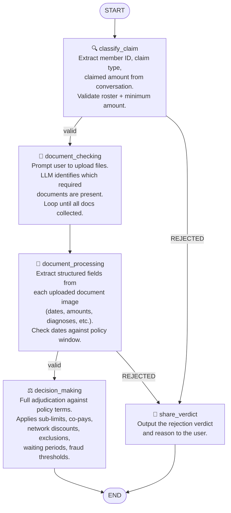

# LangGraph — Claim Processing Graph

## Graph diagram

---

## Node reference

### `classify_claim_node`
**File:** `graph.py`

The entry point for every claim. Runs an LLM extraction loop using the `CLAIM_EXTRACTION_PROMPT` (fetched from Langfuse) to pull three pieces of information out of the free-text conversation:

| Field | Description |
|---|---|
| `member_id` | Employee or dependent ID (e.g. `EMP003`, `DEP001`) |
| `claim_category` | Type of claim — one of `CONSULTATION`, `DIAGNOSTIC`, `PHARMACY`, `DENTAL`, `VISION`, `ALTERNATIVE_MEDICINE` |
| `claimed_amount` | Amount in ₹ the claimant is submitting |

If any field is missing after an extraction pass, the node prompts the user for the missing details (CLI: reads from stdin; API: returns a `collecting_info` response). The loop continues until all three fields are present.

Once all fields are collected, two hard-rejection rules are applied before passing state downstream:

- Member ID not found on the roster → `REJECTED`
- Claimed amount < ₹500 → `REJECTED`

**Langfuse:** Uses `CLAIM_EXTRACTION_PROMPT` (versioned, remotely managed).

---

### `document_checking_node`
**File:** `document_checking.py`

Determines which supporting documents are required for the claim category and collects them from the user. Required documents per category:

| Category | Required |
|---|---|
| CONSULTATION | PRESCRIPTION, HOSPITAL_BILL |
| DIAGNOSTIC | PRESCRIPTION, LAB_REPORT, HOSPITAL_BILL |
| PHARMACY | PRESCRIPTION, PHARMACY_BILL |
| DENTAL | HOSPITAL_BILL |
| VISION | PRESCRIPTION, HOSPITAL_BILL |
| ALTERNATIVE_MEDICINE | PRESCRIPTION, HOSPITAL_BILL |

The node encodes uploaded files as base64 image blocks and passes them to the LLM along with a system prompt (composed from `DOCUMENT_CHECKING_PROMPT` + `GENERIC_DOCUMENT_PROMPT`, both fetched from Langfuse). The LLM returns a structured `DocumentVerification` response identifying which required document types are present in the uploaded images.

Already-verified documents are passed to each subsequent call so the LLM only needs to evaluate new uploads. The loop continues until all required documents are accounted for.

**Langfuse:** Uses `DOCUMENT_CHECKING_PROMPT` and `GENERIC_DOCUMENT_PROMPT` (versioned, remotely managed).

---

### `document_processing_node`
**File:** `document_processing.py`

Extracts structured field data from every required document. For each document type, the node invokes the LLM with structured output bound to the corresponding Pydantic schema (`DOCUMENT_MODEL_MAP` in `document_models.py`), producing typed fields with per-field confidence scores:

- `1.0` — printed text, fully legible
- `0.8` — handwritten text, fully legible
- `0.2–0.5` — partially legible
- `0.0` — unreadable or absent

Extracted fields include dates, amounts, diagnoses, hospital names, practitioner details, and line items depending on document type.

After extraction, the node applies two date-based rejection rules:

1. **30-day initial waiting period** — if the document date (issue date, report date, or sample date) falls within the first 30 days of the policy start date (`2024-04-01`), the claim is immediately rejected.
2. **Policy period check** — if the document date falls outside the policy window (`2024-04-01` to `2025-03-31`), the claim is rejected.

These are fast-fail checks; if either triggers, `document_processing_node` returns `REJECTED` directly without proceeding to adjudication.

---

### `decision_making_node`
**File:** `decision_making.py`

The adjudication engine. Receives the full `ClaimState` including extracted document data and applies the complete `PLUM_GHI_2024` policy ruleset embedded in its system prompt. The LLM works through a structured three-step decision workflow:

**Step 1 — Hard rejections** (evaluated first; any failure → `REJECTED`)
- Treatment date outside policy period
- Claimed amount < ₹500
- Claim submitted > 30 days after treatment
- Initial or condition-specific waiting period not met
- Pre-existing condition claimed within 365 days of join date
- Diagnosis or procedure on the exclusions list
- MRI/CT scan > ₹10,000 without pre-authorization
- Pre-authorization expired (treatment > 30 days after pre-auth issue date)

**Step 2 — Manual review triggers** (any match → `MANUAL_REVIEW`)
- Claimed amount > ₹25,000
- Average document confidence score < 0.4
- Bill amount significantly differs from claimed amount
- Altered or conflicting documents
- >2 claims on the same treatment date (fraud signal)
- >6 claims in the current calendar month (fraud signal)
- Critical fields null or unreadable

**Step 3 — Amount calculation** (all other cases → `APPROVED` or `PARTIAL`)
Applied in sequence: category sub-limit cap → per-claim cap (₹5,000) → co-pay → network discount (for network hospitals/labs). If the final approved amount is less than the claimed amount, the verdict is `PARTIAL`.

The `reason` field is always a numbered checklist — every policy rule evaluated (pass or fail) must appear as a line item. For `MANUAL_REVIEW` decisions, the reason is an exhaustive trace listing every ambiguity and recommended verification step for the human reviewer.

Member context (join date, days since joining) is looked up from `policy_terms.json` and passed to the LLM to enable waiting period calculations.

**Note:** The `today_date` used in this node is a randomly sampled date within the policy period, set at session creation time. This simulates claims being filed on different dates during the active policy year.

---

### `share_verdict_node`
**File:** `share_verdict.py`

A lightweight terminal-output node used only in the CLI graph. It prints the claim verdict and rejection reason to stdout before the graph terminates. It does not modify state.

In the API mode this node is not invoked — the verdict is instead returned by the `GET /claims/{session_id}/verdict` endpoint.

---

## Conditional edges

| From | Condition | To |
|---|---|---|
| `classify_claim` | `claim_verdict == REJECTED` | `share_verdict` |
| `classify_claim` | otherwise | `document_checking` |
| `document_processing` | `claim_verdict == REJECTED` | `share_verdict` |
| `document_processing` | otherwise | `decision_making` |

---

## State (`ClaimState`)

The full state object passed between nodes:

| Field | Type | Set by |
|---|---|---|
| `conversation_history` | `List[str]` | Session init, `classify_claim` |
| `member_id` | `Optional[str]` | `classify_claim` |
| `claimed_amount` | `Optional[float]` | `classify_claim` |
| `classification` | `Optional[ClaimClassification]` | `classify_claim` |
| `policy_start_date` | `str` | Session init |
| `policy_end_date` | `str` | Session init |
| `today_date` | `str` | Session init (random date in policy window) |
| `collected_documents` | `Optional[List[str]]` | `document_checking` |
| `all_uploaded_file_paths` | `Optional[List[str]]` | `document_checking` |
| `extracted_documents` | `Optional[List[Any]]` | `document_processing` |
| `claim_verdict` | `Optional[ClaimVerdictEnum]` | `classify_claim`, `document_processing`, `decision_making` |
| `claim_decision_reason` | `str` | `classify_claim`, `document_processing`, `decision_making` |

---

## Observability

All LLM calls are traced in **Langfuse**. The Langfuse callback handler is attached at graph invocation time, producing a full trace per claim run that includes:

- Input/output for every node
- Prompt versions used at call time
- Token counts and latencies
- Structured output returned by each extraction/decision step

Prompts (`CLAIM_EXTRACTION_PROMPT`, `DOCUMENT_CHECKING_PROMPT`, `GENERIC_DOCUMENT_PROMPT`) are managed in Langfuse and fetched at runtime. This means prompt changes take effect immediately without redeploying the application.
